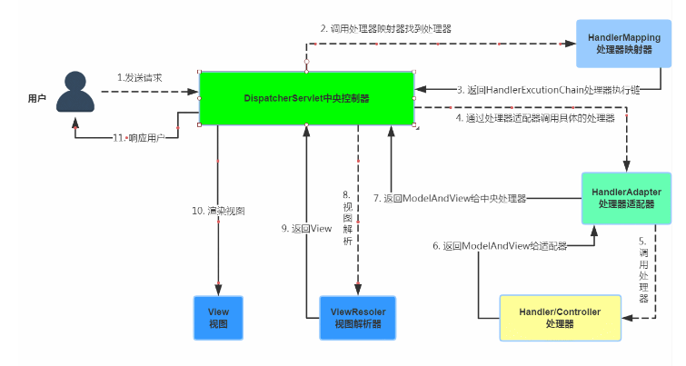
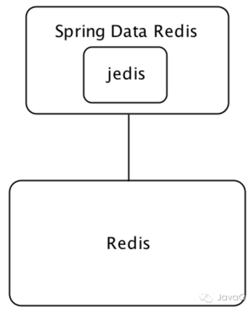

# ssm后台管理系统笔记 #

## 1.Spring MVC + Spring +Mybatis框架整合

###1.SpringMVC工作流程图

  
 

### 2.pom.xml文件

### 3.工程目录结构

- common:响应结构及常量。
- controller:控制层目录。@controller
- entity：实体层目录。
- dao:数据库接口层。
- redis：缓存层。@compoment
- service：服务层。@Service
- utils：工具类。

### 4.资源文件夹(resources)

####mapper文件夹：

数据库操作文件，对应dao层和entity。

####application.xml
1. 注解驱动的依赖注入，自动扫描。

    <!-- 自动扫描 -->

    <context:component-scan base-package="com.ssm.demo.dao"/>

    <context:component-scan base-package="com.ssm.demo.service"/>

    <context:component-scan base-package="com.ssm.demo.redis"/>

2. 存储数据库信息。

 <!-- 数据源 -->
    <bean id="dataSource" class="com.alibaba.druid.pool.DruidDataSource" init-method="init" destroy-method="close">
        <!-- 基本属性 url、user、password -->
        <property name="url" value="${jdbc.url}"/>
        <property name="username" value="${jdbc.username}"/>
        <property name="password" value="${jdbc.password}"/>
        <!-- 配置初始化大小、最小、最大 -->
        <property name="initialSize" value="${druid.initialSize}"/>
        <property name="minIdle" value="${druid.minIdle}"/>
        <property name="maxActive" value="${druid.maxActive}"/>
        <!-- 配置获取连接等待超时的时间 -->
        <property name="maxWait" value="${druid.maxWait}"/>
        <!-- 配置间隔多久才进行一次检测，检测需要关闭的空闲连接，单位是毫秒 -->
        <property name="timeBetweenEvictionRunsMillis" value="${druid.timeBetweenEvictionRunsMillis}" />
        <!-- 配置一个连接在池中最小生存的时间，单位是毫秒 -->
        <property name="minEvictableIdleTimeMillis" value="${druid.minEvictableIdleTimeMillis}" />
        <!--用来检测连接是否有效的sql，要求是一个查询语句。如果validationQuery为null，testOnBorrow、testOnReturn、testWhileIdle都不会其作用。-->
        <property name="validationQuery" value="${druid.validationQuery}" />
        <!--申请连接的时候检测，如果空闲时间大于timeBetweenEvictionRunsMillis，执行validationQuery检测连接是否有效。-->
        <property name="testWhileIdle" value="${druid.testWhileIdle}" />
        <!-- 申请连接时执行validationQuery检测连接是否有效，做了这个配置会降低性能 -->
        <property name="testOnBorrow" value="${druid.testOnBorrow}" />
        <!-- 归还连接时执行validationQuery检测连接是否有效，做了这个配置会降低性能-->
        <property name="testOnReturn" value="${druid.testOnReturn}" />
        <!-- 打开PSCache，并且指定每个连接上PSCache的大小  如果用Oracle，则把poolPreparedStatements配置为true，mysql可以配置为false。-->
        <property name="poolPreparedStatements" value="${druid.poolPreparedStatements}" />
        <property name="maxPoolPreparedStatementPerConnectionSize" value="${druid.maxPoolPreparedStatementPerConnectionSize}" />
        <!-- 配置监控统计拦截的filters -->
        <property name="filters" value="${druid.filters}"/>
        <!--Start 慢sql监控及log4j设置-->
        <property name="proxyFilters">
            <list>
                <ref bean="stat-filter"/>
                <ref bean="log-filter"/>
            </list>
        </property>
        <!--End 慢sql监控及log4j设置,不想监控的话将proxyFilters属性删除即可 -->
    </bean>

3. 加载数据源。

<!-- 配置数据源 -->
    <bean class="org.springframework.beans.factory.config.PropertyPlaceholderConfigurer">
        <property name="locations">
            <list>
                <value>classpath*:/jdbc-druid-config.properties</value>
            </list>
        </property>
    </bean>
4. 装载sessionFactory

<!-- 配置mybatis的sqlSessionFactory -->
    <bean id="sqlSessionFactory" class="org.mybatis.spring.SqlSessionFactoryBean">
        <property name="dataSource" ref="dataSource"/>
        <!-- 自动扫描mappers.xml文件 -->
        <property name="mapperLocations" value="classpath:mappers/*.xml"></property>
        <!-- mybatis配置文件 -->
        <property name="configLocation" value="classpath:mybatis-config.xml"></property>
    </bean>

5. 整合Mybatis

6. 配置事物

   <!-- (事务管理)transaction manager, use JtaTransactionManager for global tx -->
    <bean id="transactionManager"
          class="org.springframework.jdbc.datasource.DataSourceTransactionManager">
        <property name="dataSource" ref="dataSource"/>
    </bean>

7. 配置事物通知属性

<!-- 配置事务通知属性 -->
    <tx:advice id="txAdvice" transaction-manager="transactionManager">
        <!-- 定义事务传播属性 -->
        <tx:attributes>
            <tx:method name="insert*" propagation="REQUIRED"/>
            <tx:method name="import*" propagation="REQUIRED"/>
            <tx:method name="update*" propagation="REQUIRED"/>
            <tx:method name="upd*" propagation="REQUIRED"/>
            <tx:method name="edit*" propagation="REQUIRED"/>
            <tx:method name="save*" propagation="REQUIRED"/>
            <tx:method name="add*" propagation="REQUIRED"/>
            <tx:method name="new*" propagation="REQUIRED"/>
            <tx:method name="set*" propagation="REQUIRED"/>
            <tx:method name="remove*" propagation="REQUIRED"/>
            <tx:method name="delete*" propagation="REQUIRED"/>
            <tx:method name="del*" propagation="REQUIRED"/>
            <tx:method name="change*" propagation="REQUIRED"/>
            <tx:method name="check*" propagation="REQUIRED"/>
            <tx:method name="get*" propagation="REQUIRED" read-only="true"/>
            <tx:method name="search*" propagation="REQUIRED" read-only="true"/>
            <tx:method name="find*" propagation="REQUIRED" read-only="true"/>
            <tx:method name="load*" propagation="REQUIRED" read-only="true"/>
            <tx:method name="*" propagation="REQUIRED" read-only="true"/>
        </tx:attributes>
    </tx:advice>
8. 配置事物切面

<!-- 配置事务切面 -->
    <aop:config>
        <aop:pointcut id="serviceOperation"
                      expression="(execution(* com.ssm.demo.service.*.*(..)))"/>
        <aop:advisor advice-ref="txAdvice" pointcut-ref="serviceOperation"/>
    </aop:config>

9. 整合MVC框架

#### mybatis-config.xml

	<configuration>
	    <typeAliases>
	        <package name="com.ssm.demo.entity"/>
	    </typeAliases>
	</configuration>

为实体类配置别名

#### springmvc.xml

!-- 使用注解的包，包括子集 -->
    <context:component-scan base-package="com.ssm.demo.controller"/>

    <!-- 文件上传 缺少此配置会报错 -->
    <bean id="multipartResolver"
          class="org.springframework.web.multipart.commons.CommonsMultipartResolver">
        <!-- 10M -->
        <property name="maxUploadSize" value="10485760"/>
        <property name="defaultEncoding" value="UTF-8"/>
    </bean>

    <!-- Start: 配置json消息转换器 & 参数解析-->
    <bean id="objectMapper" class="com.fasterxml.jackson.databind.ObjectMapper">
        <property name="dateFormat">
            <bean class="java.text.SimpleDateFormat">
                <constructor-arg index="0" type="java.lang.String" value="yyyy-MM-dd HH:mm:ss"/>
            </bean>
        </property>
    </bean>
    <mvc:annotation-driven>
        <mvc:argument-resolvers>
            <bean class="com.ssm.demo.controller.handler.TokenToUserMethodArgumentResolver"/>
        </mvc:argument-resolvers>
        <mvc:message-converters register-defaults="true">
            <bean class="org.springframework.http.converter.json.MappingJackson2HttpMessageConverter">
                <property name="supportedMediaTypes">
                    <list>
                        <value>application/json; charset=UTF-8</value>
                    </list>
                </property>
                <property name="prettyPrint" value="true"/>
                <property name="objectMapper" ref="objectMapper"/>
            </bean>
        </mvc:message-converters>
    </mvc:annotation-driven>
    <!-- End: 配置json消息转换器 & 参数解析 -->

    <!-- 使用了<url-pattern>/</url-pattern>,所以要对静态资源进行处理 -->
    <mvc:default-servlet-handler/>

    <!-- 3.定义视图解析器 -->
    <bean id="viewResolver"
          class="org.springframework.web.servlet.view.InternalResourceViewResolver">
        <property name="prefix" value="/"></property>
        <property name="suffix" value=".html"></property>
    </bean>

### 5.web.xml

主要用于配置欢迎页，Filter,Listener,Servlet

	<?xml version="1.0" encoding="UTF-8"?>
	<web-app xmlns:xsi="http://www.w3.org/2001/XMLSchema-instance" xmlns="http://java.sun.com/xml/ns/javaee"
         xsi:schemaLocation="http://java.sun.com/xml/ns/javaee http://java.sun.com/xml/ns/javaee/web-app_2_5.xsd"
         id="WebApp_ID" version="2.5">
    <display-name>ssm-demo</display-name>

    <!--Start 欢迎页-->
    <welcome-file-list>
        <welcome-file>index.html</welcome-file>
    </welcome-file-list>
    <!--End 欢迎页-->
加载application.xml

    <context-param>
        <param-name>contextConfigLocation</param-name>
        <param-value>classpath:applicationContext.xml</param-value>
    </context-param>

配置过滤器

    <!--Start 编码过滤器 解决乱码问题-->
    <filter>
        <filter-name>encodingFilter</filter-name>
        <filter-class>org.springframework.web.filter.CharacterEncodingFilter</filter-class>
        <init-param>
            <param-name>encoding</param-name>
            <param-value>UTF-8</param-value>
        </init-param>
    </filter>
    <filter-mapping>
        <filter-name>encodingFilter</filter-name>
        <url-pattern>/*</url-pattern>
    </filter-mapping>
    <!--End 编码过滤器 解决乱码问题-->

配置监听器

    <!--Start spring监听器 -->
    <listener>
        <listener-class>org.springframework.web.context.ContextLoaderListener</listener-class>
    </listener>
    <!--End Start spring监听器 -->

配置spring-mvc

    <!--Start spring mvc servlet-->
    <servlet>
        <servlet-name>springMVC</servlet-name>
        <servlet-class>org.springframework.web.servlet.DispatcherServlet</servlet-class>
        <init-param>
            <param-name>contextConfigLocation</param-name>
            <param-value>classpath:spring-mvc.xml</param-value>
        </init-param>
        <load-on-startup>1</load-on-startup>
    </servlet>
    <!--End spring mvc servlet-->

配置页面访问路径

    <!--Start servlet-mapping -->
    <servlet-mapping>
        <servlet-name>springMVC</servlet-name>
        <url-pattern>/</url-pattern>
    </servlet-mapping>
    <!--End servlet-mapping -->

    <!--druid监控页面 -->
    <servlet>
        <servlet-name>DruidStatView</servlet-name>
        <servlet-class>com.alibaba.druid.support.http.StatViewServlet</servlet-class>
        <init-param>
            <!-- 不允许清空统计数据 -->
            <param-name>resetEnable</param-name>
            <param-value>false</param-value>
        </init-param>
        <init-param>
            <!-- 用户名 -->
            <param-name>loginUsername</param-name>
            <param-value>gitchat-ssm</param-value>
        </init-param>
        <init-param>
            <!-- 密码 -->
            <param-name>loginPassword</param-name>
            <param-value>FnzW0m49JjasWH5N</param-value>
        </init-param>
    </servlet>
    <servlet-mapping>
        <servlet-name>DruidStatView</servlet-name>
        <url-pattern>/druid/*</url-pattern>
    </servlet-mapping>
    <!--druid监控页面 -->

    </web-app>

## 2.登录模块实现

Web项目，客户端连接服务器通常采用HTTP协议，HTTP协议用于定义客户端和Web服务器通讯的格式，但是HTTP协议是无状态协议，在后台系统多个页面之间的切换需要一直的用户状态，所以需要采用Cookie或者Session获取用户的登录信息。

### 前端：

参数验证：前端通过读取输入数据进行字符串匹配验证

前端通过Ajax请求获取到token并存储在cookie中

### 后端：

通过用户名和密码查询用户记录，业务层更新token，登录成功则生成新的Token并存在数据库中，同时将token返回前端，进行保存。

### 登录状态保持

登录状态保持即Token值是否存在且有效。是否存在通过前端来控制，是否有效则通过后端代码进行验证，但是大部分接口都需要进行登录验证，如果每个方法都添加查询名用户数据则显得多余，因此对方法进行抽取。

业务层根据用户名和密码生成新的token并存到数据库

	public AdminUser updateTokenAndLogin(String userName, String password) {
	        AdminUser adminUser = adminUserDao.getAdminUserByUserNameAndPassword(userName, MD5Util.MD5Encode(password, "UTF-8"));
	        if (adminUser != null) {
	            //登录后即执行修改token的操作
	            String token = getNewToken(System.currentTimeMillis() + "", adminUser.getId());
	            if (adminUserDao.updateUserToken(adminUser.getId(), token) > 0) {
	                //返回数据时带上token
	                adminUser.setUserToken(token);
	                return adminUser;
	            }
	        }
	        return null;
	    }

自定义TokenToUesr注解，使用注解和Aop方式将用户对象注入到方法中

如果请求头不存在token或者token值是错误的则验证身份错误，否则成功。

## 3.分页功能实现

页码和总条数。

前端定义：

    jsonReader: {
            root: "data.list",//数据列表
            page: "data.currPage",//当前页码
            total: "data.totalPage",//数据总页数
            records: "data.totalCount"//数据总记录数
     },

jsonReader对象定义对后端返回的JSON数据进行解析。

后端新建Result实现序列化接口。并定义数据响应格式。

	 public class Result<T> implements Serializable {
	    private static final long serialVersionUID = 1L;
	    private int resultCode;
	    private String message;
	    private T data;

所有数据会被设置到data属性中，分页数据结果集的数据格式定义如下：

	public class PageResult implements Serializable {
	
		//总记录数
		private int totalCount;
		//每页记录数
		private int pageSize;
		//总页数
		private int totalPage;
		//当前页数
		private int currPage;
		//列表数据
		private List<?> list;

AdminUserDao.xml增加查询用户列表和查询用户总数代码。

查询用户列表

	<select id="findAdminUsers" parameterType="Map" resultMap="AdminUserResult">
	        select id,user_name,create_time from tb_admin_user
	        where is_deleted=0
	        order by id desc
	        <if test="start!=null and limit!=null">
	            limit #{start},#{limit}
	        </if>
	    </select>

查询用户总数

	  <select id="getTotalAdminUser" parameterType="Map" resultType="int">
	        select count(*) from tb_admin_user
	        where is_deleted=0
	    </select>

业务层

	 public PageResult getArticlePage(PageUtil pageUtil) {
	        List<Article> articleList = articleDao.findArticles(pageUtil);
	        int total = articleDao.getTotalArticles(pageUtil);
	        PageResult pageResult = new PageResult(articleList, total, pageUtil.getLimit(), pageUtil.getPage());
	        return pageResult;
	    }

控制层

	@RequestMapping(value = "/list", method = RequestMethod.GET)
	    public Result list(@RequestParam Map<String, Object> params) {
	        if (StringUtils.isEmpty(params.get("page")) || StringUtils.isEmpty(params.get("limit"))) {
	            logger.error("请求用户列表错误，参数异常！");
	            return ResultGenerator.genErrorResult(Constants.RESULT_CODE_PARAM_ERROR, "参数异常！");
	        }
	        //查询列表数据
	        PageUtil pageUtil = new PageUtil(params);
	        logger.info("请求用户列表成功，参数为 page:" + params.get("page").toString() + ",limit:" + params.get("limit").toString());
	        return ResultGenerator.genSuccessResult(adminUserService.getAdminUserPage(pageUtil));
	    }

## 4.图片管理模块

利用SpringMVC实现文件上传，需要借助**MultipartResolver类**。

文件上传相关依赖包
     <!-- Start: commons相关依赖包 -->
        <dependency>
            <groupId>commons-io</groupId>
            <artifactId>commons-io</artifactId>
            <version>${commons-io.version}</version>
        </dependency>
        <dependency>
            <groupId>commons-fileupload</groupId>
            <artifactId>commons-fileupload</artifactId>
            <version>${commons-fileupload.version}</version>
        </dependency>
        <!-- Start: commons相关依赖包 -->

在spring-mvc.xml设置MultipartResolver，使用CommonsMultipartResovler实现类

	<bean id="multipartResolver"  class="org.springframework.web.multipart.commons.CommonsMultipartResolver">
	    <!-- 设定默认编码 -->
	    <property name="defaultEncoding" value="UTF-8"></property>
	    <!-- 设定文件上传的最大值为5MB，5*1024*1024 -->
	    <property name="maxUploadSize" value="5242880"></property>
	    </bean>

文件对象已经被封状态到MultipartFile对象中，再代码中直接使用此文件对象，之后调用File相关方法将文件存储到upload目录中。

## 5.文件导入与导出功能

使用Apache POI的API，实现Excel表格的导入和导出。

## 6.文本编辑器模块实现

1. 下载KindEditor插件代码并放进项目的plugins目录中。
2. 在HTML代码中引入KindEditor相关文件。
3. 添加编辑框元素
4. 表结构设计：主键id，标题，内容，添加人，创建时间，更新时间，是否已经删除。

## 7.加入Redis缓存整合

### 1.添加依赖

	<jedis.version>2.9.0</jedis.version>
	        <spring-redis.version>1.7.2.RELEASE</spring-redis.version>
	
	         <!-- Start: redis -->
	         <dependency>
	             <groupId>org.springframework.data</groupId>
	             <artifactId>spring-data-redis</artifactId>
	             <version>${spring-redis.version}</version>
	         </dependency>
	
	         <dependency>
	             <groupId>redis.clients</groupId>
	             <artifactId>jedis</artifactId>
	             <version>${jedis.version}</version>
	         </dependency>
	         <!-- End: redis -->
### 2，新建redis配置类RedisCacheConfig。继承CachingConfigurerSurpport,

### 3.将配置中的Bean注入到Spring中，在applicationContext.xml中加入以下配置：

<!-- 自动扫描 -->
    <context:component-scan base-package="com.ssm.demo.redis"/>

### 4.封装Redis工具类

将增删改查等操作命令提取为一个工具类，Redis没有update更新命令，需要经过删除在添加进行更新。使用Spring data redis实现缓存

  
 

### 5.整合缓存的代码

查询Redis的数据，如果存在则直接返回，不存在则从Mysql数据库中读取并存储至Redis中

	 //根据id获取对应详情
	    @Override
	    public Article queryObject(Integer id) {
	        logger.info("根据id获取文章数据:" + id);
	        Article article = (Article) redisUtil.get(Constants.ARTICLE_CACHE_KEY + id, Article.class);
	        if (article != null) {
	            logger.info("文章数据已存在于redis中直接读取:" + Constants.ARTICLE_CACHE_KEY + id);
	            return article;
	        }
	        Article articleFromMysql = articleDao.getArticleById(id);
	        if (articleFromMysql != null) {
	            logger.info("redis中无此文章的数据,从MySQL数据库中读取文章并存储至redis中:" + Constants.ARTICLE_CACHE_KEY + id);
	            redisUtil.put(Constants.ARTICLE_CACHE_KEY + articleFromMysql.getId(), articleFromMysql);
	            return articleFromMysql;
	        }
	        return null;
	    }
### 6.数据一致性

在进行数据库修改，删除操作时，需要对缓存进行更新或者清除。

## 8.nginx与tomcat，负载均衡的实现

1. 下载并安装nginx，并启动：start nginx,nginx -s stop,nginx默认监听80端口。
2. 复制两个Tomcat目录，进入conf目录中的server.xml,修改相关配置，将Tomcat1的三个端口分别修改为8081，8082，8083，8082为浏览器访问端口。Tomcat2的三个端口分别修改为8084，8085，8086，8085为浏览器访问端口。
3. 进入nginx安装目录，编辑conf目录下的nginx.conf配置文件，在http节点下加入upstream节点，增加如下内容：

	upstream HA-tomcat{
	    server locahost:8082;
	    server locahost:8085;
	}

4. 在server节点下的location/节点添加如下内容：

	proxy_pass http://HA-tomcat;

上述配置了nginx代理转发的规则，当浏览器访问http：//localhost时，nginx会将请求转发至HA-tomcat服务器组，之后根据负载均衡算法请求分配相应的Tomcat服务器处理。配置完后，重启nginx服务器。

### Nginx负载均衡算法

- 轮询(默认)

每个请求会按照时间顺序逐一分配给不同的后端服务。后端某态服务器死机，会自动剔除故障系统，以使用户的访问不受影响，前面的HA-tomcat就使用了这种默认方式。

- weight(轮询权值)

weight值越大，被访问的概率就越高。当后端服务器的性能不均衡时，可以考虑使用这种方式。可为主机设置更高的权值，以使主机资源得到合理高效的利用，比如有三个Tomcat服务分别部署在两台linux服务器上，其中一台服务器配置较高，而另一台较低，那么高配置Linux服务器上的Tomcat服务的权重可以设置得高一点，配置如下：

	 upstream HA-tomcat{
	    server 192.168.90.1:8082 weight=20;
	    server 192.168.90.2:8085 weight=10;
	    server 192.168.90.2:8088 weight=10;
	    }

192.168.90.1机器的配置比较高，权重可以设置的大一些。

- 哈希算法(ip_hash,url_hash)

**ip_hash**

每个请求按访问IP的哈希结果分配，使来自同一个IP的访客固定访问一台后端服务器，配置方式如下：

	 upstream HA-tomcat{
	    ip_hash;
	    server 192.168.90.1:8082;
	    server 192.168.90.2:8085;
	    server 192.168.90.2:8088;
	    }

**url_hash**

按访问URL的哈希结果来分配请求，使每个URL定向到一台后端服务器，可以进一步提高后端缓存的服务器效率。Nginx本身不支持url_hash，如果需要这种调度算法，则必须安装Nginx的hash软件包。

- fair

可以根据页面大小和加载时间长短智能地进行负载均衡，也就是根据后端服务器的响应时间来分配请求，响应时间短的优先分配。Nginx本身不支持fair，如果需要需要这种调度算法，必须安装upstream_fair模块。其配置如下：

	upstream HA-tomcat{
	    server 192.168.90.1:8082;
	    server 192.168.90.2:8085;
	    server 192.168.90.2:8088;
	    fair;
	    }

## 9.数据库连接池